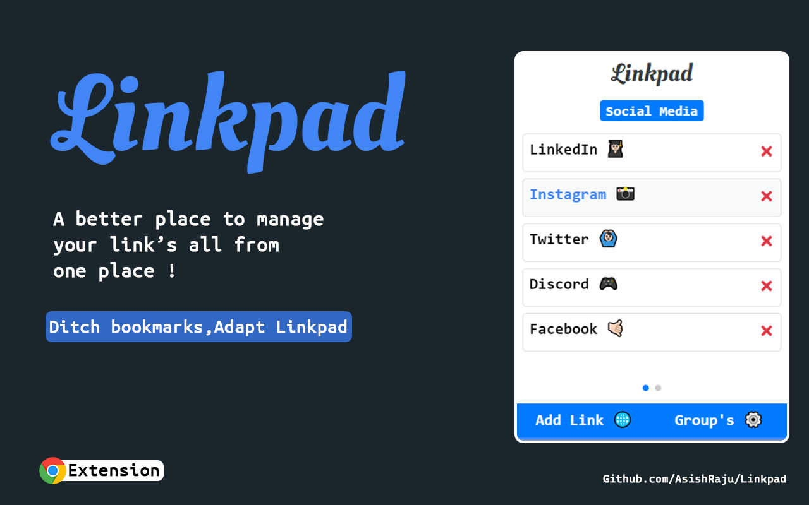

# Linkpad 🔗

### Ditch bookmarks . Adapt Linkpad ✔

### [Add to your chrome]
```
Do Rate ⭐ and send in Reviews 😄
```
## Overview 👀



[See Demo Here]

- Categorise your links with groups 📂 
- Light weight **<140Kb** 😱
- Dark Mode 🌓 
- Keyboard Navigation ⌨ 
- Clean and resposive UI ⚡
- Double click to copy your link 🗒 
- Single click to open the link in new tab 🌐 
- **Alt+L** to open Linkpad Extension 👍🏻

## What is Linkpad ❓

- Linkpad is a chrome extension to manage your link's all from one place. In short its a URL manager that stores url for faster acess in future by the user

- **Chrome bookmark's does the exact same thing then why Linkpad?**

    - Well, yes chrome bookmarks does the same thing but with lot of extra steps leading to lot of navigation and hard to find the bookmark when in need. Linkpad solves this problem by using simple ui and having all the important functionality(copy link,open link) that a user does with a url all one  **click away**

- Yes, you can tell Linkpad is same as chrome bookmark's but with a better UI, redability and hiding all the unecessary functionality for the user 

- Did i reinvent the wheel? **You decide 😅**

## Sidenote 📄
- Currently keyboard navigation only works on left/right arrow keys which can be used to navigate around diffrent groups

- Usage of **tab** key navigation is not recommended leads to buggy aftermath data and loss of navigation. **A big no !**

## WIP 🛠

- [ ] Adding favicons to links
- [ ] Looping group's
- [ ] Up/Down arrow key link's navigation
- [ ] Sortable link's list
- [ ] Fix tab navigation bug

## How To Contribute🤝 

- Yes,it is open source you can clone and change code to your need.
- I suggest you to use sandbox **dist\popup.js** before contributing
- Most of the code is self explanatory and well commented
- Will be waiting for your PR's 👨🏻‍💻 ✌🏻
- For any clarification on code you can raise a issue or find me here
- [Gmail] / [Twitter] /[LinkedIn]

[Gmail]: <mailto:vashish888@gmail.com>
[LinkedIn]: <https://www.linkedin.com/in/asish-raju-7a0b90192>
[Twitter]: <https://twitter.com/vashish888>
[Add to your chrome]: <https://chrome.google.com/webstore/detail/linkpad/nomgglnafmlbgjfcfhgpelfcpjlbkkpk>
[See Demo Here]:<https://youtu.be/GR6RNwUi49k>